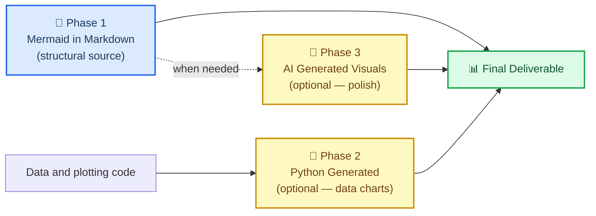
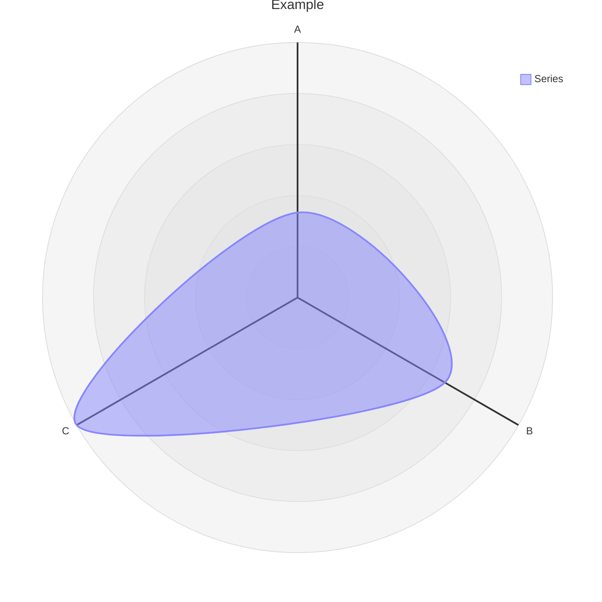

# Markdown and Mermaid Writing

## Overview

This skill provides an optional house style for **Markdown documentation with Mermaid
structural diagrams**. Follow the requested output format, existing repository conventions,
and journal requirements first. This skill does not replace scientific analysis or plotting.

A relationship expressed as Mermaid inside a `.md` file is editable text that diffs
cleanly in git. A compatible host renders it without a separate user build step.
It renders where the host has Mermaid support; plain Markdown viewers may show only code,
and platforms/extensions ship different Mermaid versions. It uses
a compact source representation, though token use depends on the diagram. Exporting
SVG/PNG requires a renderer; retain the diagram source alongside exported figures.

> "The more you get your reports and files in .md in just regular text, which mermaid is
> as well as being a simple 'script language'. This just helps with any downstream rendering
> and especially AI generated images (using mermaid instead of just long form text to
> describe relationships < tokens). Additionally mermaid can render along with markdown for
> easy use almost anywhere by humans or AI."
>
> — Clayton Young (@borealBytes), K-Dense Discord, 2026-02-19

## When to Use This Skill

Use this skill when:

- Writing a requested Markdown report, README, methods overview, or research note
- Diagramming a workflow, data pipeline, schema, state machine, or conceptual relationship
- Maintaining editable Mermaid sources and their rendered SVG/PNG exports

Use scientific plotting tools directly for measured data, uncertainty, statistical graphics,
exact geometry, or publication figures that Mermaid cannot faithfully represent. Mermaid
is not a required precursor to a quantitative chart or an existing SVG/code-native asset.

## 🎨 The Source Format Philosophy

### Why text-based diagrams win

| What matters | Mermaid in Markdown | Python / AI Image |
| ----------------------------- | :-----------------: | :---------------: |
| Git diff readable | ✅ text source | Plotting code/SVG can also be text |
| Editable source | ✅ | Plotting scripts and vector sources are editable |
| Compact relationship notation | Often | Depends on representation |
| Native preview | Host/version dependent | Viewer/format dependent |
| Parseable by AI without vision | ✅ | ❌ |
| Works in destination | Check Mermaid support and version | Check image format support |
| Accessible (screen readers) | Check SVG metadata and text alternative | Provide alt text/data table |
| Convertible to image later | ✅ anytime | — already image |

### The three-phase workflow



Retain Mermaid for structural diagrams and data/code for quantitative charts. An AI illustration
is not a quantitative conversion; verify every label and relationship against its sources.

### What Mermaid can express

This skill includes 23 diagram-type guides plus a composition guide. Mermaid supports
additional types; these references are a curated subset, not an exhaustive version catalogue:

| Use case | Diagram type | File |
| -------------------------------------------- | ---------------- | ---------------------------------------------------- |
| Experimental workflow / decision logic | Flowchart | `references/diagrams/flowchart.md` |
| Service interactions / API calls / messaging | Sequence | `references/diagrams/sequence.md` |
| Data model / schema | ER diagram | `references/diagrams/er.md` |
| State machine / lifecycle | State | `references/diagrams/state.md` |
| Project timeline / roadmap | Gantt | `references/diagrams/gantt.md` |
| Proportions / composition | Pie | `references/diagrams/pie.md` |
| System architecture (zoom levels) | C4 | `references/diagrams/c4.md` |
| Concept hierarchy / brainstorm | Mindmap | `references/diagrams/mindmap.md` |
| Chronological events / history | Timeline | `references/diagrams/timeline.md` |
| Class hierarchy / type relationships | Class | `references/diagrams/class.md` |
| User journey / satisfaction map | User Journey | `references/diagrams/user_journey.md` |
| Two-axis comparison / prioritization | Quadrant | `references/diagrams/quadrant.md` |
| Requirements traceability | Requirement | `references/diagrams/requirement.md` |
| Flow magnitude / resource distribution | Sankey | `references/diagrams/sankey.md` |
| Numeric trends / bar + line charts | XY Chart | `references/diagrams/xy_chart.md` |
| Component layout / spatial arrangement | Block | `references/diagrams/block.md` |
| Work item status / task columns | Kanban | `references/diagrams/kanban.md` |
| Cloud infrastructure / service topology | Architecture | `references/diagrams/architecture.md` |
| Multi-dimensional comparison / skills radar | Radar | `references/diagrams/radar.md` |
| Hierarchical proportions / budget | Treemap | `references/diagrams/treemap.md` |
| Binary protocol / data format | Packet | `references/diagrams/packet.md` |
| Git branching / merge strategy | Git Graph | `references/diagrams/git_graph.md` |
| Code-style sequence (programming syntax) | ZenUML | `references/diagrams/zenuml.md` |
| Multi-diagram composition patterns | Complex Examples | `references/diagrams/complex_examples.md` |

> 💡 **Pick the right type, not the easy one.** Don't default to flowcharts for everything.
> A timeline beats a flowchart for chronological events. A sequence beats a flowchart for
> service interactions. Scan the table and match.

---

## 🔧 Core workflow

### Step 1: Identify the document type

Check if a template exists before writing from scratch:

| Document type | Template |
| ------------------------------ | ----------------------------------------------- |
| Pull request record | `templates/pull_request.md` |
| Issue / bug / feature request | `templates/issue.md` |
| Sprint / project board | `templates/kanban.md` |
| Architecture decision (ADR) | `templates/decision_record.md` |
| Presentation / briefing | `templates/presentation.md` |
| Research paper / analysis | `templates/research_paper.md` |
| Project documentation | `templates/project_documentation.md` |
| How-to / tutorial | `templates/how_to_guide.md` |
| Status report | `templates/status_report.md` |

### Step 2: Read the style guide

For this Markdown workflow, read `references/markdown_style_guide.md`. Treat emoji,
heading counts, and horizontal rules as house style rather than Markdown syntax requirements.

Key rules to internalize:

- **One H1 per document** — the title. Never more.
- **Emoji on H2 headings only** — one emoji per H2, none in H3/H4
- **Support factual claims** — use verified sources and the requested citation format
- **Bold sparingly** — max 2-3 bold terms per paragraph, never full sentences
- **Optional horizontal rules** after `</details>` when they improve separation
- **Tables over prose** for comparisons, configurations, structured data
- **Diagrams over walls of text** — if it describes flow, structure, or relationships, add Mermaid

### Step 3: Pick the diagram type and read its guide

Before creating any Mermaid diagram: read `references/mermaid_style_guide.md`.

Then open the specific type file (e.g., `references/diagrams/flowchart.md`) for the exemplar, tips, and copy-paste template.

Add accessibility metadata for types that emit it in the chosen renderer:

```
accTitle: Short Name 3-8 Words
accDescr: One or two sentences explaining what this diagram shows.
```

- Prefer host themes; `%%{init}` directives are deprecated in favor of YAML configuration
- Prefer reusable `classDef` where supported; style syntax is diagram-specific
- **One emoji per node max** — at the start of the label
- Use descriptive IDs with the type's syntax: `snake_case` works for flowcharts; ER/class/state conventions differ

### Step 4: Write the document

Start from the template. Apply the markdown style guide. Place diagrams inline with related text — not in a separate "Figures" section.

Render in the **actual destination** before delivery. Check its Mermaid version and
plugin requirements before choosing newer diagram types; [GitHub documents an `info`
diagram for this check](https://docs.github.com/en/get-started/writing-on-github/working-with-advanced-formatting/creating-diagrams).
A successful latest-version local preview does not establish GitHub or another host
will render it. Where Mermaid is unsupported, supply a rendered SVG/PNG with a text
description alongside the retained `.md` source.

### Step 5: Retain source and verification

Keep the `.md` source, rendered deliverable, and tested renderer version together.
Follow the project's version-control workflow; this skill does not itself authorize a commit or publication.
For CLI export, embedding, and the tested accessibility matrix, read
[Current rendering and validation](references/current-rendering.md).

---

## ⚠️ Common pitfalls

### Radar chart syntax (`radar-beta`)

**WRONG (shown as text so it does not break the document renderer):**
```text
radar
title Example
x-axis ["A", "B", "C"]
"Series" : [1, 2, 3]
```

**CORRECT:**


- **Use `radar-beta`** not `radar` (the bare keyword doesn't exist)
- **Use `axis`** to define dimensions, **not** `x-axis`
- **Use `curve`** to define data series, **not** quoted labels with colon
- Mermaid 12.0.0 radar emits `accTitle`/`accDescr`; check older hosts and retain a visible description

### XY Chart vs Radar confusion

| Diagram | Keyword | Axis syntax | Data syntax |
| ------- | ------- | ----------- | ----------- |
| **XY Chart** (bars/lines) | `xychart-beta` | `x-axis ["Label1", "Label2"]` | `bar [10, 20]` or `line [10, 20]` |
| **Radar** (spider/web) | `radar-beta` | `axis id["Label"]` | `curve id["Label"]{10, 20}` |

### Forgetting `accTitle`/`accDescr` on supported types

Only some diagram types support `accTitle`/`accDescr`. For those that don't, always place a descriptive italic paragraph directly above the code block:

> _Radar chart comparing three methods on a stated, common score scale. See the data table for exact values._

```text
radar-beta
...
```

---

## 🔗 Integration with other skills

### With `scientific-schematics`

`scientific-schematics` generates AI-powered publication-quality images (PNG). Use the Mermaid diagram as the **brief** for the schematic:

```
Workflow:
1. Create the concept as Mermaid in .md (this skill — Phase 1)
2. Describe the same concept to scientific-schematics for a polished PNG (Phase 3)
3. Commit both — the .md as source, the PNG as a supplementary figure
```

### With `scientific-writing`

For a manuscript that uses Mermaid structural figures, this skill handles diagram syntax.
Follow the manuscript's required figure formats and scientific visualization conventions.

```
Workflow:
1. Use scientific-writing to draft the manuscript
2. For every figure that shows a workflow, architecture, or relationship:
   - Replace placeholder with a Mermaid diagram following this skill's guide
3. Use plotting or schematic tools where appropriate to the scientific content
```

### With `literature-review`

Literature review produces summaries with lots of relationship data. Use this skill to:

- Create concept maps (Mindmap) of the literature landscape
- Show publication timelines (Timeline or Gantt)
- Compare methodologies (Quadrant or Radar)
- Diagram data flows described in papers (Sequence or Flowchart)

### With any skill that produces output documents

Before finalizing a document using this skill, check:

- [ ] Does the document use a template? If so, did I start from the right one?
- [ ] Is each diagram in an appropriate format, with working accessibility metadata or a text alternative?
- [ ] Is configuration supported by the destination and tested in light/dark themes?
- [ ] Do citations support external claims, and are synthetic values labeled?
- [ ] One H1, emoji on H2 only?
- [ ] Does the final Markdown/HTML structure render correctly?

---

## 📚 Reference index

### Style guides

| Guide | Path | Lines | What it covers |
| ----------------------- | ------------------------------------------- | ----- | -------------------------------------------------- |
| Markdown Style Guide | `references/markdown_style_guide.md` | see file | Headings, formatting, citations, tables, Mermaid integration, templates, quality checklist |
| Mermaid Style Guide | `references/mermaid_style_guide.md` | see file | Accessibility, emoji set, color classes, theme neutrality, type selection, complexity tiers |
| Current Rendering | `references/current-rendering.md` | see file | Mermaid 12 changes, CLI export, browser APIs, tested accessibility matrix, scientific checks |

### Diagram guides (23 types plus composition)

Each file contains: production-quality exemplar, tips specific to that type, and a copy-paste template.

`references/diagrams/` — architecture, block, c4, class, complex\_examples, er, flowchart, gantt, git\_graph, kanban, mindmap, packet, pie, quadrant, radar, requirement, sankey, sequence, state, timeline, treemap, user\_journey, xy\_chart, zenuml

### Document templates (9 types)

`templates/` — decision\_record, how\_to\_guide, issue, kanban, presentation, project\_documentation, pull\_request, research\_paper, status\_report

### Examples

`assets/examples/example-research-report.md` — a synthetic quality-control report with explicitly invented data, an auditable count table, a structural flowchart, a bar chart, and a chronology. It makes no experimental or software API claims.

---

## 📝 Attribution

All style guides, diagram type guides, and document templates in this skill are ported from the `SuperiorByteWorks-LLC/agent-project` repository under the Apache-2.0 License.

- **Source**: https://github.com/SuperiorByteWorks-LLC/agent-project
- **Author**: Clayton Young / Superior Byte Works, LLC (@borealBytes)
- **License**: Apache-2.0

This skill (as part of scientific-agent-skills) is distributed under the MIT License. The included Apache-2.0 content is compatible for downstream use with attribution retained, as preserved in the file headers throughout this skill.

---

[^1]: GitHub Blog. (2022). "Include diagrams in your Markdown files with Mermaid." https://github.blog/2022-02-14-include-diagrams-markdown-files-mermaid/

[^2]: Mermaid. "Mermaid Diagramming and Charting Tool." https://mermaid.js.org/
